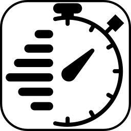
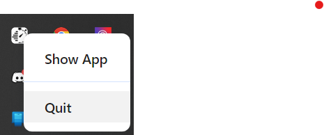
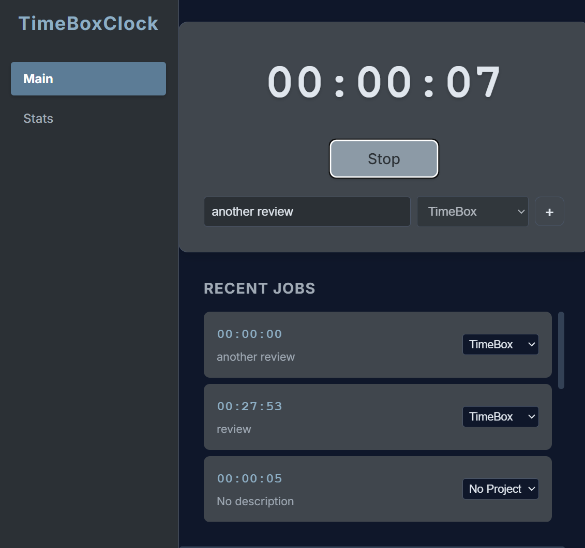
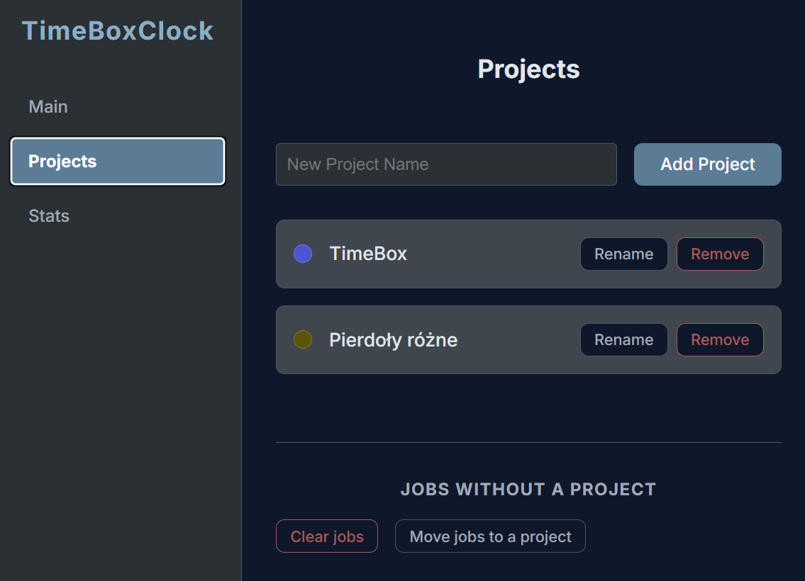

# TimeBoxClock



TimeBoxClock is a simple time-boxing application that helps you to focus on your tasks.



It sits in a tray. When needed, shows a main window. From here you can easily start or stop a timer. Each measurement can be assigned to a project. 

For now it detects user's locale and shows appropriate language. Right now, only English and Polish are supported.



On projects page you can see list of projects, add new project and rename or delete existing projects.
Also on this page you can group manage existing jobs without any project assigned - those
jobs can be either assigned to a project or deleted.

[!NOTE]
All jobs older than today, are grouped by date and project on each application start.




On stats page you can see time stats of each project.


Application is written using TypeScript + React + Vite + Electron.

## Installation

```bash
npm install
```

## Usage

```bash
npm run dev
```

## Run tests:

```bash
npm test
```

## Build

```bash
npm run build
```

## License

MIT

